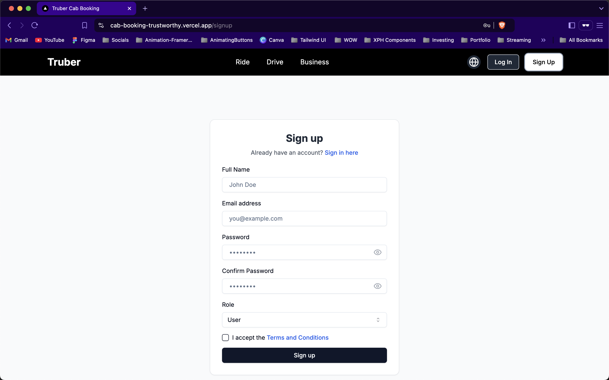

# Cab Booking System

A Next.js 14 application for managing cab bookings.

## Setup and Installation

1. Clone the repository:

```bash
git clone https://github.com/spyware007/cab-booking-system.git
cd cab-booking-system
```

2. Install dependencies:

```bash
npm install --legacy-peer-deps
```

3. Create a `.env.local` file in the root directory with the following content:

```bash
MONGODB_URI= your_mongodb_uri
NEXTAUTH_SECRET= your_nextauth_secret
NEXTAUTH_URL= http://localhost:3000
MAIL_HOST= smtp.gmail.com
EMAIL_USER= user_email
EMAIL_PASS= email_pass
```

4. Run the development server:

```bash
npm run dev
```

5. Open [http://localhost:3000](http://localhost:3000) in your browser to see the application.

## Features

- User authentication (user, admin and driver)
- Cab booking management
- Admin panel for managing locations, routes, and cabs
- Email notifications (using smtp google and nodemailer)

# [Watch the video demo](https://drive.google.com/file/d/1ptH9gcLYFKYuvBVdqoVyvpLQwNXZOXiw/view?usp=sharing)

## Screenshots

<div align="center" style="display:flex">
  
</div>

<table>
  <tr>
    <td></td>
    <td></td>
  </tr>
  <tr>
    <td></td>
    <td></td>
  </tr>
  <tr>
    <td></td>
    <td></td>
  </tr>
  <tr>
    <td></td>
    <td></td>
  </tr>
</table>

## Tech Stack

- **Frontend:**

  - Next.js 14
  - Tailwind CSS
  - shadcn/ui components
  - framer-motion

- **Backend:**

  - Next.js api routes
  - MongoDB

- **Authentication:**

  - NextAuth.js

- **Other Tools:**

  - TypeScript
  - Zustand
  - Nodemailer
  - Lucide Icons

## Contributing

Contributions are welcome! Please feel free to submit a Pull Request.

## License

This project is licensed under the MIT License.
